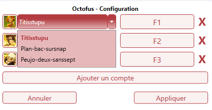

# Octofus - Outil multi-compte pour Dofus

 

Outil fait avec le coeur pour tous les joueurs dofus !
Si cet outil vous plaît, vous êtes libre de pouvoir me supporter [en m'offrant un café]("https://www.buymeacoffee.com/rls606") !

Certaines illustrations sont la propriété d'Ankama Studio et de Dofus - Tous droits réservés.

## Téléchargement

Télécharger la **dernière version stable** [ici](https://github.com/veeenu/eldenring-practice-tool/releases/latest).

## Conseil d'utilsiation

- **N'attribuez pas vos comptes à des touches que vous utilisez couremment** (exemple les lettres, ça vous empêchera d'écrire).

- **Désactivez l'ensemble des notifications** dans dofus ( Menu d'options -> Alertes ).

## Démarrage de l'outil

Une fois démarré, l'outil se met dans votre barre de tâche.

En faisant clique droit des options s'offrent à vous.

### Configuration

En faisant clique droit sur l'icone, vous avez accès au menu de configuration. Afin de détecter les différents compte, ils **doivent être ouvert** sur votre ordinateur. Si ils le sont **ils apparaitront dans la liste déroulante**.

Vous pouvez attribuer une **image au compte**, celle-ci apparaîtra dans l'interface principale. Nous vous conseillez **des images carré** (avec des dimensions comme **100x100px**). Des images sont mises à dipositions dans le dossier **"Images"**.

## Assistance

Si vous avez quelconque problème, **contactez moi sur Discord** !

# Credits

- Merci à ma copine pour les logos (typographie + logo). ❤️